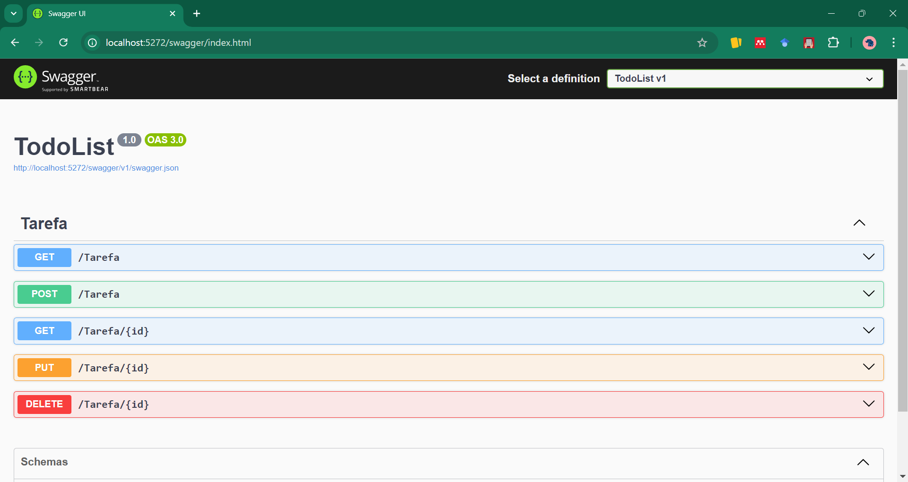

# API Todo List

## Descrição

Implementação de uma lista de tarefas usando ASP.NET. Versão sem implementação da persistência de dados.

## Funções

- Visualizar tarefas
- Adicionar tarefa
- Editar tarefa
- Deletar tarefa

## Rotas

- [GET]/ - Retorna todas as tarefas da lista
- [GET]/{id} - Retorna a tarefa com o `id` correspondente, caso o `id` seja encontrado
- [POST]/ - Cria uma tarefa usando o conteúdo enviado no body request
- [PUT]/{id} - Altera as informações da tarefa correspondente ao `id` informado, caso o `id` seja encontrado. As alterações deveram ser enviadas no body request. O `id` informado no path deve corresponder ao `id` contido no body request.
- [DELETE]/{id} - Apaga a tarefa correspondente ao `id` informado, caso o `id` seja encontrado.

